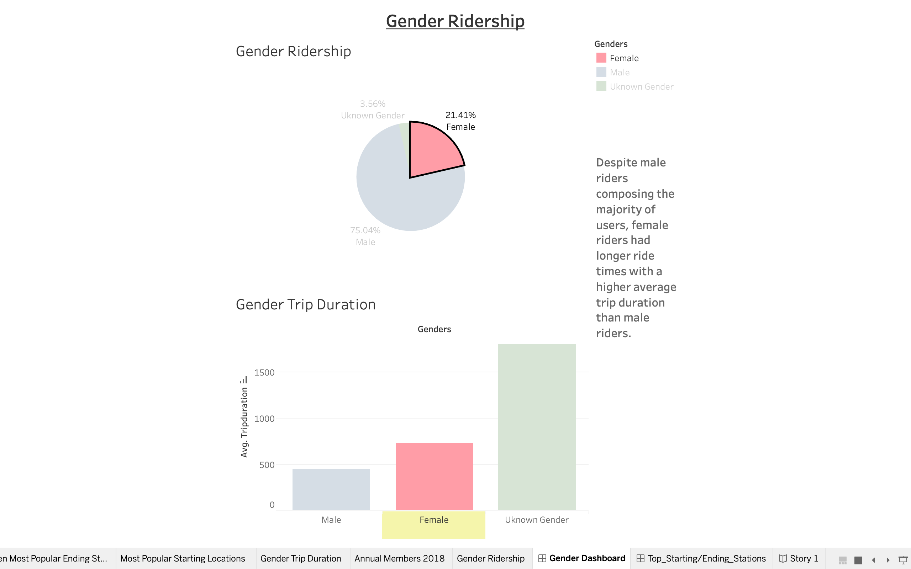
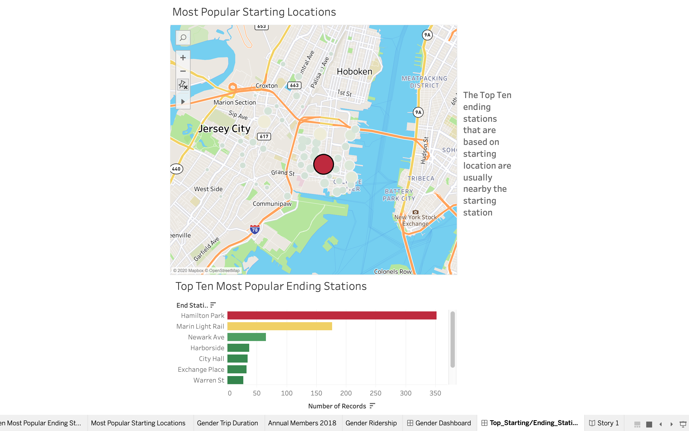
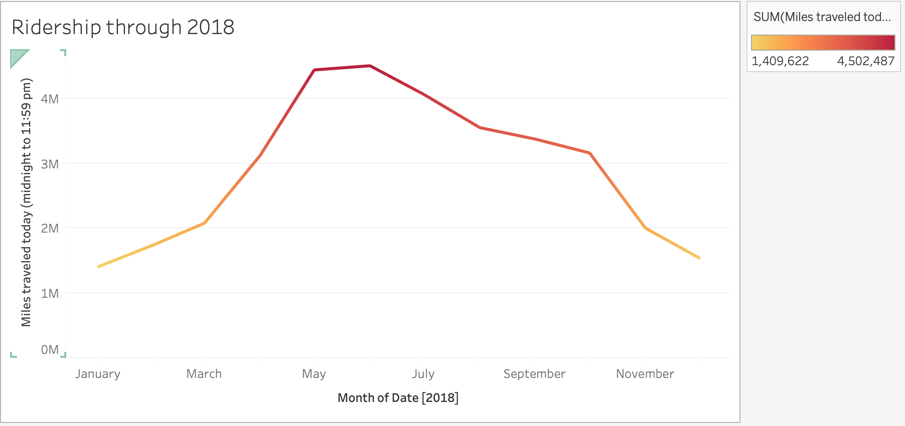

# Citi Bike Analysis with Tableau

## Background

Since 2013, the Citi Bike Program has implemented a robust infrastructure for collecting data on the program's utilization. Through the team's efforts, each month bike data is collected, organized, and made public on the [Citi Bike Data](https://www.citibikenyc.com/system-data) webpage.

However, while the data has been regularly updated, the team has yet to implement a dashboard or sophisticated reporting process. City officials have a number of questions on the program, so your first task on the job is to build a set of data reports to provide the answers.

## Task

**The task at hand is to aggregate the data found in the Citi Bike Trip History Logs and find unexpected phenomenas.** 

* The Task contains
    * 4-10 "Phenomenon" Visualizations 
    * 2 Dashboards 
    * 1 City Official Map
    * 1 Story

## Findings 

* As displayed on the Dashboard in the workbook, it was found that despite male riders composing the majority of users, female riders had longer ride times with a higher average trip duration than male riders.
    * 

* This is an interactive dashboard in the work book which shows the most popular ending locations depending on the specific starting location choosen on the city official map. 
    * 

* Based on the data for the year of 2018 we could conclude that ridership increases during the spring and summer months while declines during colder months such as November and January as shown in this worksheet.
    *  

# There are many more "Phenomenon" Visualizations in the workbook which includes the story of the entire project. 

